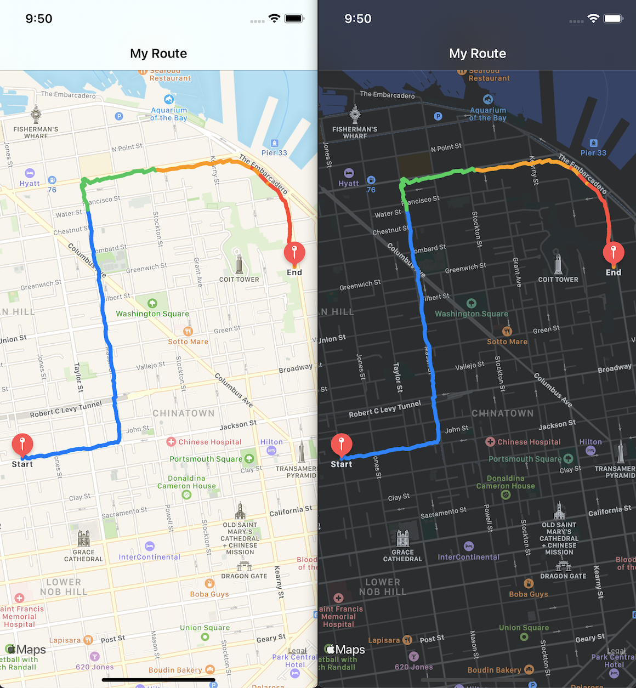

# Fitness

### Getting Started:
- Clone the repository
- Open the Fitness.xcodeproj
- Select the `Fitness` scheme
- Run (cmd+r)

### Features:
- The `Fitness` application shows the route of a user's workout journey on a map.
- The user's heart rate at various points along the route is shown on the map. Variations in heart rate intensity between points are shown by using different colors along the route.

### Additional Functionality:
- A unit test target.
